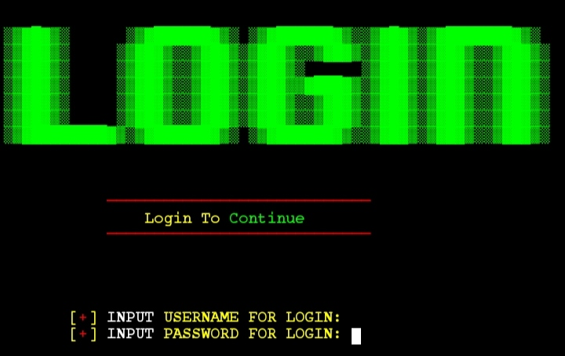
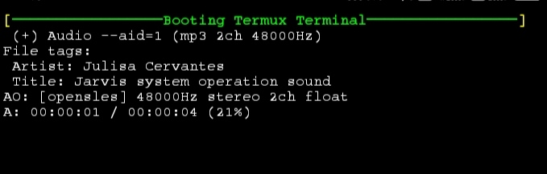

<h1 align="center">TermuX-Custom</h1>

<p align="center"> 
  
  
  <br>
<br>
<br>
  
  
  
</p>

## Description
TermuX Custom is a GitHub repository designed to empower users to personalize their TermuX experience. With TermuX Custom, you can enhance your Termux interface with features like a customizable login screen, login sound effects, and the ability to change your shell name. The interactive terminal provides a dynamic environment for your TermuX sessions.

**Repository Views**  
> **Maintained?**: Yes, This repository is Maintained and You will get Updates Regularly!

# About Termux
### What is termux?
Termux is an *Android terminal emulator* and **Linux environment** app that works directly with **no rooting** or setup required. A minimal base system is installed automatically - additional packages are available using the *PKG/APT package manager*. Read More [Here](https://termux.com/)... 
### How To install termux?

You can install termux from F-Droid. <br />

- Get it on [Github](https://github.com/termux/termux-app)
- Download from [F-Droid](https://f-droid.org/packages/com.termux/) <br />

> I don't recommend you to Install Termux from **Google Play Store** as it is now UNMAINTAINED

> But, I strongly recommend you to install Termux from **F-Droid** as it is the stable version of Termux

## Screenshorts After installing TermuX-Custom
### Login Screen

### Booting Screen

### Termux Terminal


## Features Of TermuX-Custom
- [x] Login Screen
- [x] Login Sound Effect
- [x] Customizable Shell Name
- [x] Interactive Terminal
- [X] Easy To Use
- [X] Easy To Install
- [X] In Terminal Clock
- [X] Looks OverPowered
> These features enhance the TermuX interface, providing users with a personalized and dynamic experience for their TermuX sessions.


## Getting Started
To get started, simply follow the provided commands to update and upgrade your TermuX environment, clone the TermuX Custom repository, and execute the setup script to apply the customizations. This repository is intended for educational purposes and does not endorse any malicious activities.

[-] Update and Upgarde your package lists with to latest versions:
    ```
    apt update && apt upgrade
    ```

[-] Install Github in Termux
    ```
    pkg install git
    ```
    
[-] Clone the TermuX-Custom6 repository in your Termux:
    ```
    git clone https://github.com/Cod3r-Ak/TermuX-Custom
    ```

[-] Navigate to the cloned repository directory:
    ```
    cd TermuX-Custom
    ```

[-] Add execute permissions to all files in the directory:
    ```
    chmod +x *
    ```

[-] Execute the setup script to apply customizations:
    ```
    bash setup.sh
    ```

## All Commands in Single Line
```
apt update && apt upgrade && pkg install git && git clone https://github.com/Cod3r-Ak/TermuX-Custom && cd TermuX-Custom && chmod +x * && bash setup.sh 
```
## Copyright Notice

All content, including but not limited to code, documentation, and assets, within the TermuX Custom repository is protected under copyright law. This repository, authored by Akshat [Cod3r-Ak], is provided for educational purposes only. It does not promote or condone any unauthorized access, modification, or misuse of computer systems or networks.

You are granted the right to use, modify, and distribute the contents of this repository for educational and non-commercial purposes. However, you must adhere to the following conditions:
```
1. You may not use the contents of this repository for illegal or unethical activities.
2. You may not misrepresent the origin or authorship of the contents of this repository.
3. You may not hold the author or contributors liable for any damages or legal issues arising from the use or misuse of the contents of this repository.
```
By accessing or using the contents of this repository, you agree to abide by these terms and conditions.
